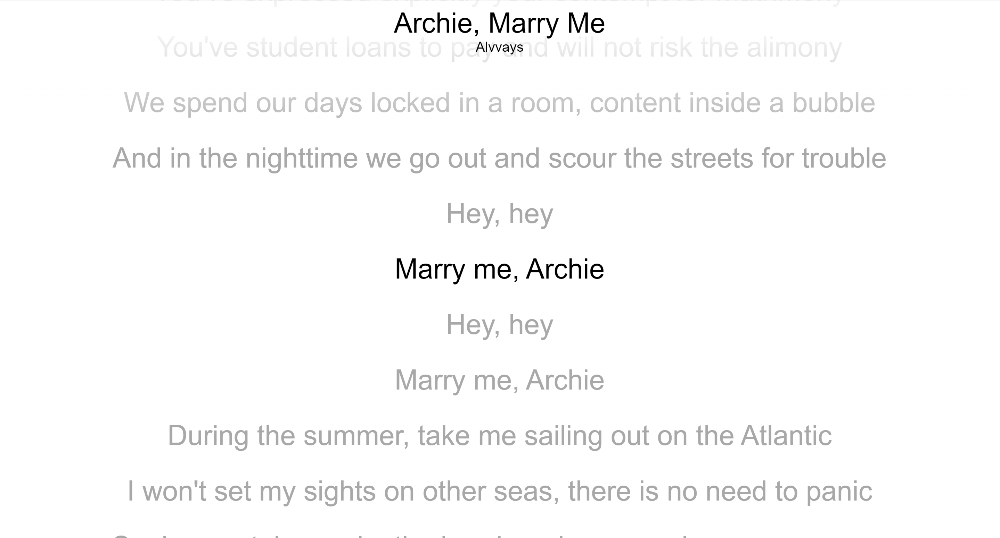
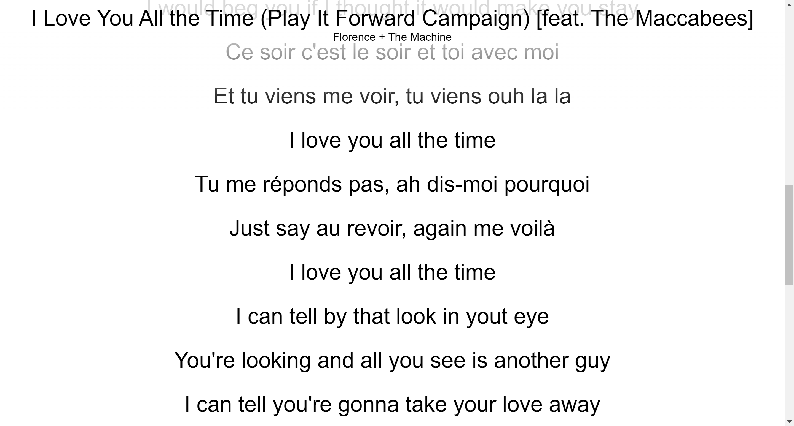
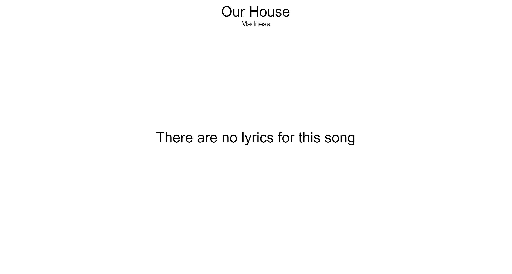

# A site that acts as a Spotify Connect device and displays lyrics

This was created to be projected on a wall and be able to project the lyrics at any time.

[The Spotify Web API SDK](https://developer.spotify.com/documentation/web-playback-sdk)

## Auto Scrolling on Lyrics is the default:

## Sometimes the lyrics are not synced, in which case you can scroll:

## Sometimes there are no lyrics :(

